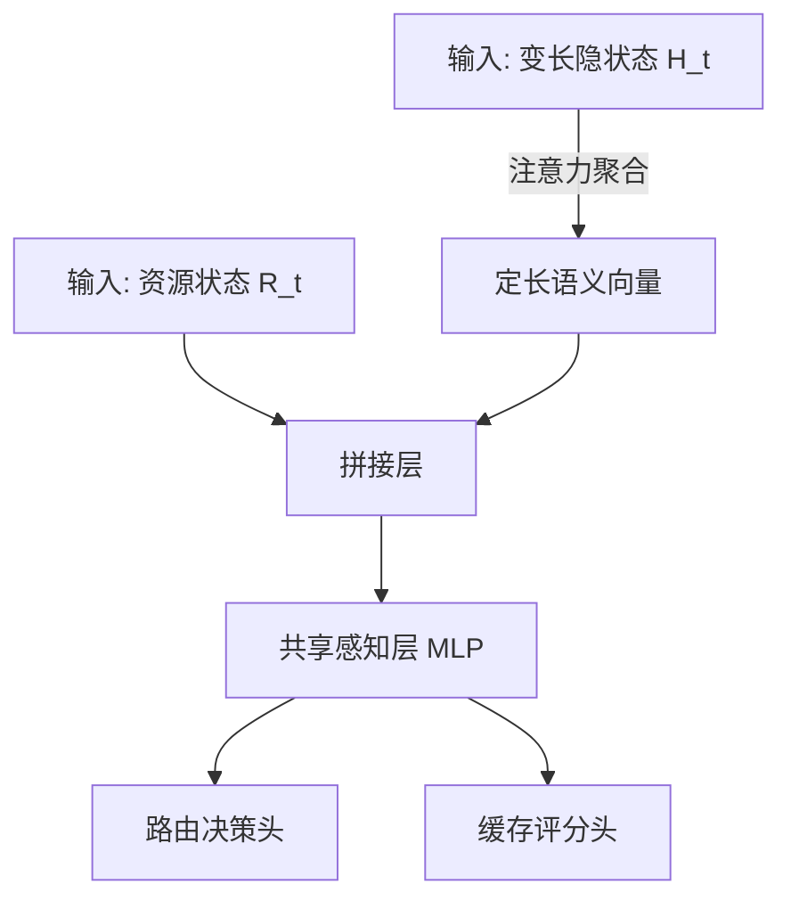

# ASA-PPO 神经网络架构详解 (基于 Qwen3-1.7B)

本文档详细拆解了我们在 **ASA-PPO** 算法中使用的神经网络结构。
根据您的指定，我们使用 **Qwen3-1.7B** 作为端侧小模型 (SLM)，其核心参数为：
*   **Hidden Size (隐藏层维度)**: `2048`
*   **KV Cache Blocks**: 假设最大为 `100` 块

---

## 1. 整体数据流图

---

## 2. 输入层 (Input Layer)

我们的模型接收两部分输入：

### A. 语义特征 (Semantic Features)
*   **来源**: **Qwen3-1.7B** 的输出 (Last Hidden State)
*   **维度**: `(Batch, Seq_Len, 2048)`
    *   `Batch`: 批次大小 (训练时通常为 64 或 128)
    *   `Seq_Len`: 序列长度 **(变长)**，例如 10, 50, 200...
    *   `2048`: **Qwen3-1.7B** 的特征维度 **(固定)**

### B. 资源特征 (Resource State, $R_t$)
*   **来源**: 环境观测 (`env.py`)
*   **维度**: `(Batch, 4)`
    *   这 4 个标量分别是：
        1.  `M_rem`: 剩余显存比例 (0~1)
        2.  `N_t`: 网络延迟 (秒)
        3.  `L_t`: 当前任务长度 (Token数)
        4.  `E_t`: 信息熵 (0~1)

---

## 3. 注意力聚合模块 (Attention Aggregation)

**作用**: 将变长的 `(Seq_Len, 2048)` 压缩为定长的 `(1, 2048)`。

*   **参数**: `Query` 向量，大小 `(2048, 1)`。
*   **计算流程**:
    1.  **打分**: `(Batch, Seq, 2048) @ (2048, 1) -> (Batch, Seq, 1)`
    2.  **归一化**: `Softmax(dim=1)` -> 得到每个 Token 的权重 $\alpha$。
    3.  **加权和**: $\sum (\alpha_i \times H_i) \to (Batch, 2048)$

**输出**: 语义向量 $V_{sem}$，维度 **`(Batch, 2048)`**

---

## 4. 拼接与共享编码器 (Shared Encoder)

**作用**: 融合“语义”与“环境”信息，提取高层特征。

*   **拼接 (Concat)**:
    *   输入 A: $V_{sem}$ `(Batch, 2048)`
    *   输入 B: $R_t$ `(Batch, 4)`
    *   **结果**: `(Batch, 2052)` (即 2048 + 4)

*   **共享 MLP 层 (Shared Net)**:
    *   **Layer 1**: `Linear(2052, 256)` + `ReLU`
        *   输入: 2052 维
        *   输出: 256 维 (压缩特征)
    *   **Layer 2**: `Linear(256, 256)` + `ReLU`
        *   输入: 256 维
        *   输出: 256 维 (加深非线性)

**输出**: 共享特征向量 $F$，维度 **`(Batch, 256)`**

---

## 5. 双头输出 (Dual Heads)

### 头 A：路由决策头 (Router Head)
**作用**: 决定这步去哪做？
*   **结构**: `Linear(256, 2)` + `Softmax`
*   **维度变化**: `(Batch, 256) -> (Batch, 2)`
*   **含义**: `[P_local, P_cloud]`，例如 `[0.8, 0.2]`。

### 头 B：缓存评分头 (Caching Head)
**作用**: 给家里的 100 个抽屉打分，决定谁该扔。
*   **结构**: `Linear(256, 100)` + `Sigmoid`
*   **维度变化**: `(Batch, 256) -> (Batch, 100)`
*   **含义**: `[0.9, 0.1, 0.5, ...]` (100 个 0~1 之间的分数)。

---

## 6. 评论家网络 (Critic Network)

**作用**: 辅助训练，打分 (Value Function)。
*   结构与 Actor 几乎一样，只是最后输出层不同。
*   **输入**: 同样的 `H_t` (2048维) + `R_t` (4维)。
*   **中间层**: 同样的 Attention + MLP。
*   **输出层**: `Linear(256, 1)` (不接激活函数)。
*   **输出**: `Value` (标量)，表示当前局势好不好。
